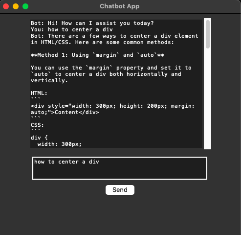

# Chatbot Application Using Tkinter and Replicate API



This is a simple Python-based chatbot application built with **Tkinter** for the GUI and the **Replicate API** for generating AI responses. The app allows users to interact with a chatbot through a user-friendly interface.

---

## Features

1. **Interactive Chat Interface**  
   - A graphical user interface (GUI) built with Tkinter.  
   - A scrollable chat display for messages.  
   - An input box and a send button for user interactions.

2. **Replicate API Integration**  
   - Utilizes the **Meta LLaMA-3-8b-Instruct** model on Replicate for generating intelligent AI responses.  
   - Customizable prompt templates for structured communication.

3. **Error Handling**  
   - Displays error messages in case of API or network issues.

4. **Environment Variable Support**  
   - Securely stores and loads the Replicate API token from a `.env` file.  

---

## Requirements

- Python 3.10+
- A valid **Replicate API Token**

---

## Setup and Usage

1. **Clone the repository**  
   ```bash
   git clone <repository_url>
   cd chatbot-tkinter-replicate
   ```

2. **Install dependencies**  
   ```bash
   pip install -r requirements.txt
   ```

3. **Add your Replicate API token**  
   Create a `.env` file in the project directory with the following content:  
   ```dotenv
   REPLICATE_API_TOKEN=your_replicate_api_token
   ```

4. **Run the application**  
   ```bash
   python app.py
   ```

5. **Interact with the chatbot**  
   - Type your message in the input box.  
   - Press **Send** to get a response from the bot.

---

## Application Structure

- **Chat Display:** Displays user messages and bot replies in a scrollable format.  
- **Input Box:** Allows users to type their messages.  
- **Send Button:** Sends the user's input to the Replicate API and displays the bot's response.

---

## Dependencies

- **Tkinter:** For building the GUI.  
- **Python-Dotenv:** To securely manage environment variables.  
- **Replicate:** To integrate with the Replicate API.

Install all required packages using:  
```bash
pip install tkinter python-dotenv replicate
```

---

## Notes

- Ensure your `.env` file contains a valid Replicate API token.  
- Modify the prompt template or model ID in the code as needed.  
- The app currently uses the `meta/meta-llama-3-8b-instruct` model. You can switch to other models supported by Replicate by updating the `replicate.run` call.

---

## License

This project is licensed under the [MIT License](LICENSE).
